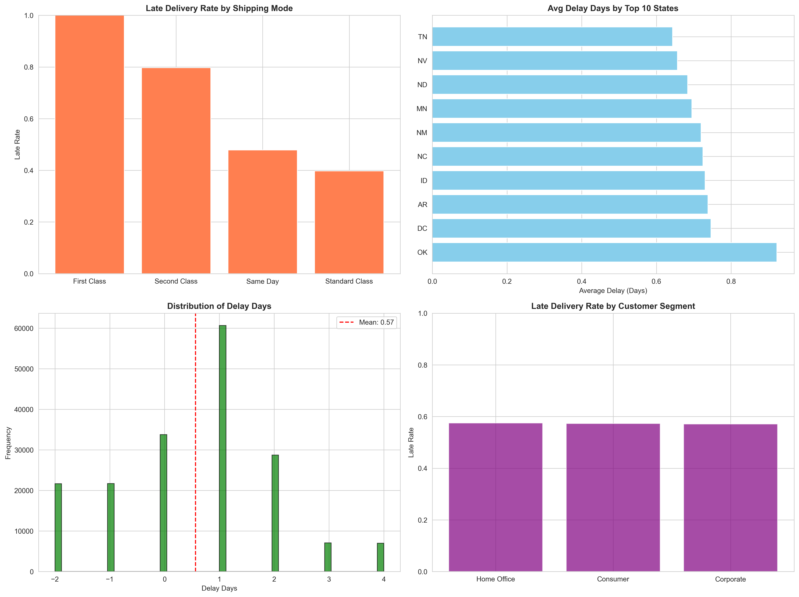
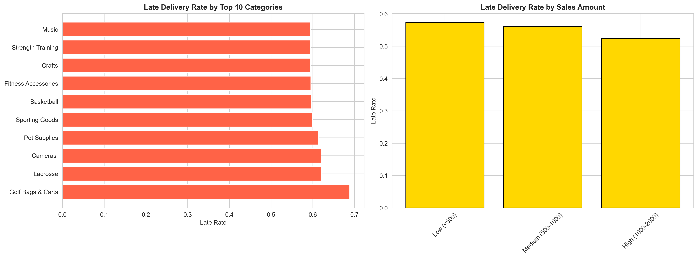
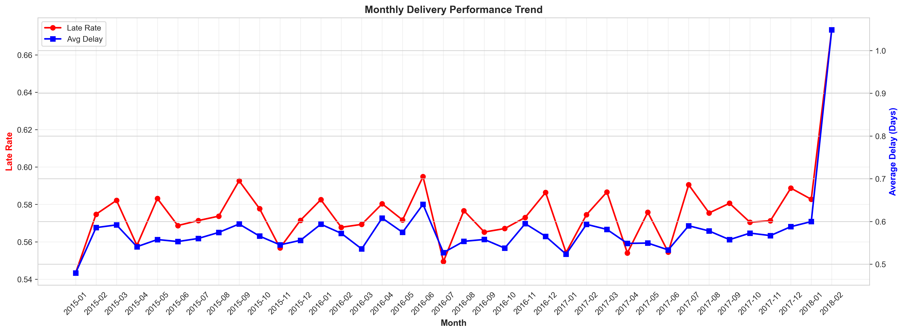
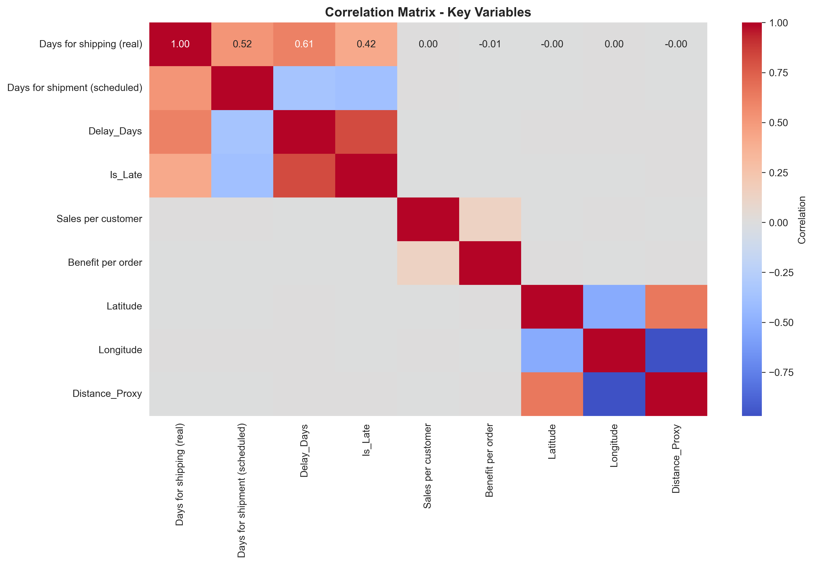
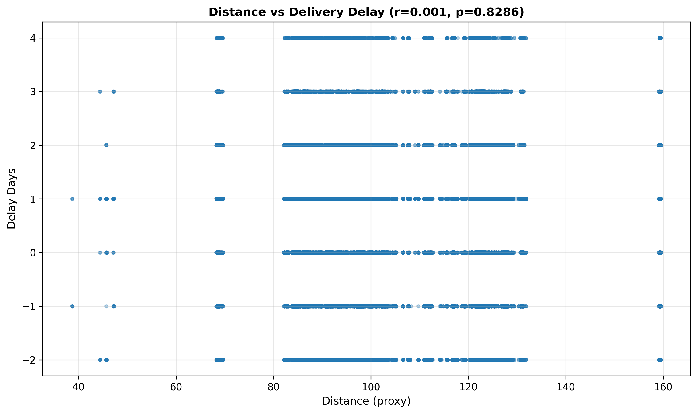

# 🚚 LogiTrack — Supply Chain & Delivery Analytics

> **End-to-end Supply Chain & Delivery Analytics project analyzing 180K+ transactions using Python, SQL, PostgreSQL, statistical analysis, and Power BI to uncover delivery risks, operational bottlenecks, and business insights.**

---

## 📌 Project Overview

**LogiTrack** is an end-to-end supply chain and delivery analytics project focused on understanding delivery performance, identifying operational bottlenecks, and analyzing factors associated with late deliveries.

The project follows a complete data analytics workflow:

**Data Exploration → Data Cleaning → Feature Engineering → EDA → PostgreSQL → SQL Business Analysis → Statistical Testing → Power BI Dashboard → Business Recommendations**

The analysis uses **180,519 supply-chain transactions** and combines Python-based exploratory analysis, SQL business analysis, statistical hypothesis testing, and Power BI visualization.

---

## 🎯 Business Problem

Late deliveries can negatively impact customer satisfaction, operational efficiency, revenue, and profitability.

This project aims to answer key business questions:

* Which shipping modes have the highest late-delivery rates?
* Which regions and states have poor delivery performance?
* Which product categories experience more delays?
* Which customer segments are most affected by late deliveries?
* Does shipping mode significantly affect delivery performance?
* Is delivery delay related to distance?
* Does order value influence delivery performance?
* What is the revenue and profitability impact of late deliveries?
* Which operational areas should logistics teams prioritize?

---

# 📊 Dataset

The project uses the **DataCo Supply Chain Dataset**.

### Dataset Overview

| Metric                   |         Value |
| ------------------------ | ------------: |
| Total Transactions       |   **180,519** |
| Original Columns         |        **53** |
| Final Analytical Columns |        **60** |
| Late Deliveries          |   **103,400** |
| On-Time Deliveries       |    **77,119** |
| Late Delivery Rate       |     **57.3%** |
| Average Delay            | **0.57 days** |
| Maximum Delay            |    **4 days** |

The dataset contains information related to:

* Orders
* Customers
* Products
* Shipping
* Delivery performance
* Sales
* Profitability
* Geography
* Customer segments
* Shipping modes

---

# 🛠️ Tech Stack

### Programming & Data Analysis

* Python
* Pandas
* NumPy

### Data Visualization

* Matplotlib
* Seaborn
* Power BI

### Database & SQL

* PostgreSQL
* SQL
* CTEs
* Window Functions
* Aggregations
* CASE Statements
* Ranking Functions

### Statistical Analysis

* One-Way ANOVA
* Pearson Correlation
* Independent Samples T-Test
* Chi-Square Test of Independence
* Hypothesis Testing

### Tools

* Jupyter Notebook
* PostgreSQL
* Git
* GitHub
* Power BI

---

# 🔄 Project Workflow

```text
Raw Data
   │
   ▼
Data Exploration
   │
   ▼
Data Cleaning
   │
   ▼
Feature Engineering
   │
   ├───────────────┐
   ▼               ▼
Python EDA     PostgreSQL
   │               │
   │               ▼
   │          SQL Business Analysis
   │               │
   └───────┬───────┘
           ▼
  Statistical Analysis
           │
           ▼
    Power BI Dashboard
           │
           ▼
 Business Recommendations
```

---

# 🧹 Data Cleaning

The dataset was prepared using Python and Pandas.

The cleaning process included:

* Data type validation and conversion
* Duplicate record checking
* Date conversion
* Numerical column validation
* Data quality checks
* Creation of analytical variables

### Final Dataset

```text
Rows:        180,519
Columns:     57
Duplicates:  0
```

---

# ⚙️ Feature Engineering

Additional variables were created to support delivery-performance analysis.

| Feature           | Description                                           |
| ----------------- | ----------------------------------------------------- |
| `Delay_Days`      | Difference between actual and scheduled shipping days |
| `Is_Late`         | Binary indicator for late delivery                    |
| `Order_YearMonth` | Monthly order aggregation                             |
| `Distance_Proxy`  | Proxy measure for geographic distance                 |
| `Distance_Bucket` | Distance-based segmentation                           |
| `Sales_Bucket`    | Order-value segmentation                              |

### Delivery Delay

```text
Delay_Days = Actual Shipping Days − Scheduled Shipping Days
```

---

# 📈 Exploratory Data Analysis

EDA was performed to identify patterns, trends, outliers, and relationships across operational and business dimensions.

The analysis focused on:

* Shipping Mode
* Delivery Status
* Customer Segment
* Product Category
* Customer State
* Sales
* Profitability
* Shipping Type
* Distance
* Delivery Delay

---

## 📊 EDA Visualizations

### 1. Delivery & Shipping Performance

The following visualizations examine delivery performance across different shipping and operational dimensions.



---

### 2. Sales & Delivery Analysis

These visualizations explore relationships between sales, order characteristics, and delivery performance.



---

### 3. Regional & Operational Analysis

These charts provide a deeper look into regional and operational delivery patterns.



---

### 4. Correlation Analysis

The correlation matrix was used to understand relationships between numerical variables and identify potentially important relationships for further statistical testing.



---

# 🗄️ PostgreSQL & SQL Business Analysis

The cleaned dataset was loaded into **PostgreSQL** for structured business analysis.

The project includes **20 business-oriented SQL analyses**, covering:

1. Overall Delivery Performance
2. Shipping Mode Performance
3. State-Level Late Delivery Analysis
4. Product Category Performance
5. Customer Segment Performance
6. Shipping Mode by Region
7. Delivery Status Distribution
8. Shipping Type Performance
9. Scheduled vs Actual Shipping Days
10. Revenue Impact of Delivery Status
11. Worst State-Category Combinations
12. Delay Magnitude Analysis
13. Best Shipping-Region Pairs
14. Order Value vs Delivery Performance
15. Profitability by Delivery Status
16. Late Orders by Shipping Mode
17. Carrier Performance Ranking
18. Regional Benchmark Comparison
19. Customer Retention Risk
20. Shipping Method Cost-Benefit Analysis

### SQL Concepts Used

```sql
GROUP BY
CASE WHEN
HAVING
CTEs
Subqueries
Window Functions
RANK()
Aggregations
Conditional Aggregation
```

---

# 🧪 Statistical Analysis

Statistical hypothesis testing was performed to determine whether observed patterns were statistically significant.

---

## 1️⃣ Shipping Mode vs Delivery Delay

**Test:** One-Way ANOVA

**Result:** Statistically significant

### Interpretation

Delivery delays differ significantly across shipping modes.

**Business implication:** Poor-performing shipping methods should be investigated and optimized.

---

## 2️⃣ Regional Delivery Performance

**Test:** One-Way ANOVA

```text
F-statistic = 4.4097
P-value     = 0.000009
```

### Interpretation

Delivery performance differs significantly across states.

**Business implication:** Region-specific logistics strategies may be required for underperforming areas.

---

## 3️⃣ Distance vs Delivery Delay

**Test:** Pearson Correlation

```text
Correlation (r) = 0.0005
P-value         = 0.828568
R²              = 0.0000
```



### Interpretation

No statistically significant relationship was found between the constructed distance proxy and delivery delay.

---

## 4️⃣ Order Value vs Delivery Performance

**Test:** Pearson Correlation

```text
Correlation (r) = -0.0040
P-value         = 0.086996
```

### Interpretation

Order value does not show a statistically significant relationship with delivery performance.

---

## 5️⃣ Shipping Type vs Delivery Delay

**Test:** Independent Samples T-Test

```text
T-statistic = -0.8636
P-value     = 0.387811
```

### Interpretation

No statistically significant difference was found between the compared shipping/payment types.

---

## 6️⃣ Shipping Mode vs Late Delivery

**Test:** Chi-Square Test of Independence

```text
Chi-Square Statistic = 37716.0425
Degrees of Freedom   = 3
P-value              < 0.05
```

### Interpretation

Shipping mode and late-delivery status are statistically dependent.

This indicates that **shipping mode selection is an important operational factor associated with delivery performance.**

---

# 🔑 Key Business Insights

### 🚚 Delivery Performance

* **57.3%** of orders were classified as late.
* **42.7%** of orders were delivered on time.
* Average delivery delay was approximately **0.57 days**.
* Maximum observed delay was **4 days**.

### 📦 Shipping Mode

* **First Class** showed the highest late-delivery rate in the analysis.
* Shipping mode showed a statistically significant relationship with delivery performance.

### 🌎 Regional Performance

* **California (CA)** had approximately **58%** late deliveries among the analyzed states.
* Regional differences in delivery performance were statistically significant.

### 🛍️ Product Category

* **Electronics** was identified as a high-volume category with comparatively high late-delivery performance.

### 👥 Customer Segment

* **Home Office** showed comparatively weak delivery performance among the analyzed customer segments.

### 📊 Statistical Findings

* Shipping mode significantly affects delivery performance.
* Regional differences are statistically significant.
* Distance did **not** have a significant relationship with delivery delay.
* Order value did **not** significantly explain delivery performance.
* Shipping type did not show a statistically significant difference in the tested comparison.

---

# 📊 Power BI Dashboard

The Power BI dashboard converts the analytical findings into an interactive business-facing view.

### Dashboard Preview

> **🚧 Power BI dashboard preview will be added here.**

### 🔗 Interactive Dashboard

**[View Interactive Power BI Dashboard](#)**

> Replace `#` with your Power BI dashboard link once it is published.

---

# 💡 Business Recommendations

Based on the analysis:

### 1. Optimize Shipping Modes

Investigate the operational reasons behind poor-performing shipping modes and evaluate whether order allocation should be adjusted.

### 2. Develop Regional Strategies

Identify states with consistently high late-delivery rates and develop region-specific logistics improvement plans.

### 3. Monitor High-Risk Categories

Track delivery performance for high-volume product categories with elevated late-delivery rates.

### 4. Monitor Customer Segments

Identify customer segments experiencing higher delivery delays to reduce dissatisfaction and potential retention risk.

### 5. Prioritize Revenue at Risk

Use revenue and profitability associated with late deliveries to prioritize operational improvements based on financial impact.

### 6. Support Data-Driven Shipping Decisions

Use historical delivery performance to improve shipping-mode selection and operational planning.

---

# 📁 Project Structure

```text
LogiTrack-Delivery-Analytics/
│
├── data/
│   ├── raw/
│   │   ├── DataCoSupplyChainDataset.csv
│   │   ├── DescriptionDataCoSupplyChain.csv
│   │   └── tokenized_access_logs.csv
│   │
│   └── processed/
│       ├── cleaned_supply_chain_data.csv
│       └── master_delivery_data.csv
│
├── data_insights/
│   ├── correlation_matrix.png
│   ├── eda_visualizations_1.png
│   ├── eda_visualizations_2.png
│   ├── eda_visualizations_3.png
│   └── stat_distance_vs_delay.png
│
├── notebooks/
│   ├── 01_data_exploration.ipynb
│   ├── 02_data_cleaning.ipynb
│   ├── 03_eda_feature_engineering.ipynb
│   ├── 04_data_loading_to_psql.ipynb
│   ├── 05_sql_buisness_analysis.ipynb
│   └── 06_statistical_analysis.ipynb
│
└── README.md
```

---

# 🎯 Skills Demonstrated

```text
Python
Pandas
NumPy
Data Cleaning
Exploratory Data Analysis
Feature Engineering
SQL
PostgreSQL
CTEs
Window Functions
Statistical Analysis
Hypothesis Testing
Matplotlib
Seaborn
Power BI
Business Analytics
Supply Chain Analytics
Data Visualization
```

---

# 👨‍💻 Project Objective

The objective of **LogiTrack** is to transform raw supply-chain transaction data into actionable business intelligence by combining **Python analytics, SQL, statistical validation, and Power BI visualization**.

The project demonstrates how data can be used to identify delivery risks, understand operational bottlenecks, evaluate business impact, and support data-driven logistics decisions.
